# finite_difference

Computes finite difference matrices for the first and second derivative up to sixth order, including compact finite-difference schemes such as the fourth-order Padé scheme and sixth-order Lele scheme (S. K. Lele. Compact finite difference schemes with spectral-like resolution. Journal of Computational Physics, 103(1):16–42, November 1992).

## Methods available

 - 2nd order
 - 4th order
 - 6th order
 - Padé (4th order compact scheme)
 - Lele (6th order compact scheme)

## Examples

### Example 1 - derivatives_example.py

This example is to demonstrate the perfomance of the different methods available. The function used in this example is given by:

$f(x) = e^{x^2}$

which has the following derivatives:

$f'(x) = 2 x e^{x^2}$

$f''(x) = 2 e^{x^2} (1 + 2x^2)$

Relative error (in log scale) obtained for the first derivative:

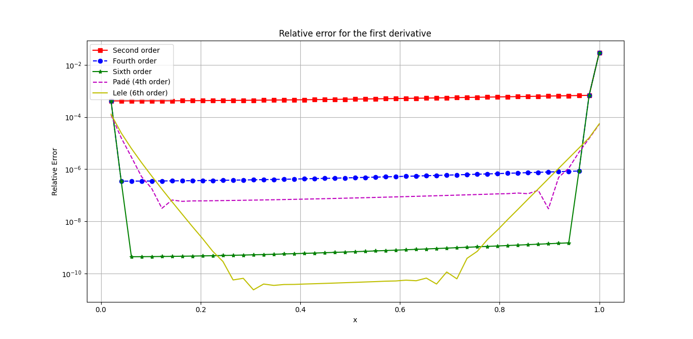

Relative error (in log scale) obtained for the second derivative:

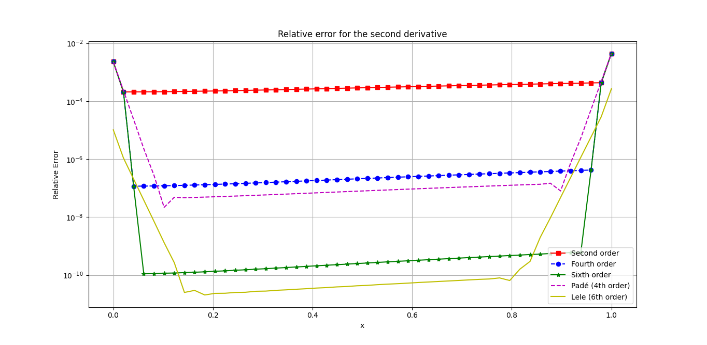

### Example 2 - 2D_first_derivatives_example.py

The function shown in the example files is given by:

$f(x,y) = \sin x \sin y$

The partial derivatives are given by:

$\frac{\partial f}{\partial x} = \cos x \sin y$

$\frac{\partial f}{\partial y} = \sin x \cos y$

The images below show the absolute error in log scale for both the partial derivatives in x and y direction.

### Second order

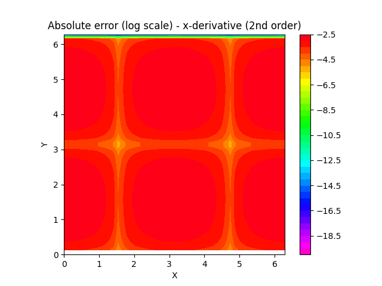 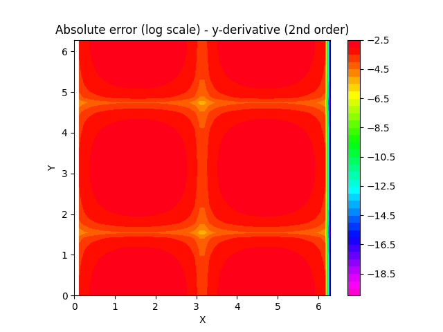

### Fourth order

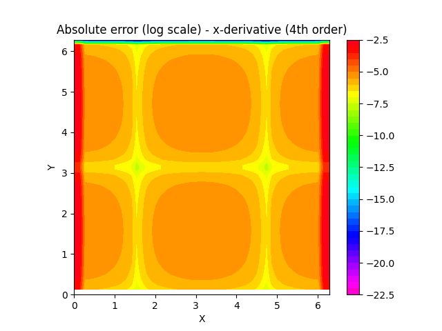 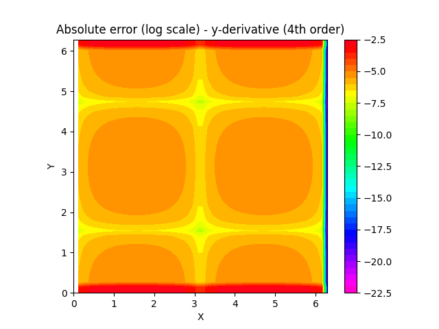

### Sixth order

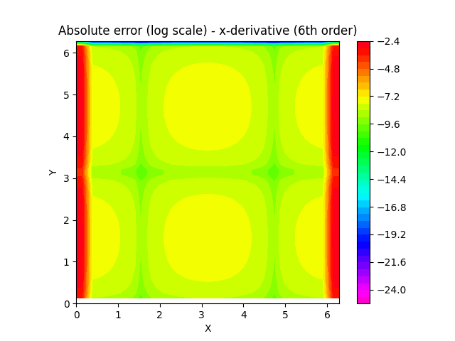 

### Padé fourth order

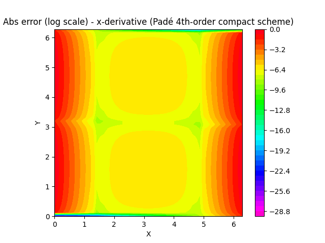 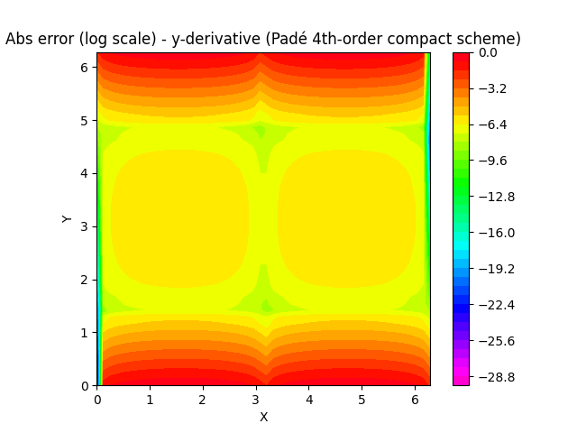

### Lele sixth order

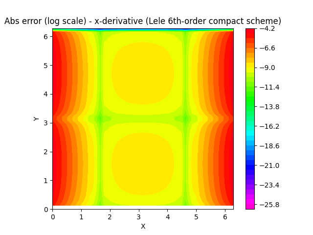 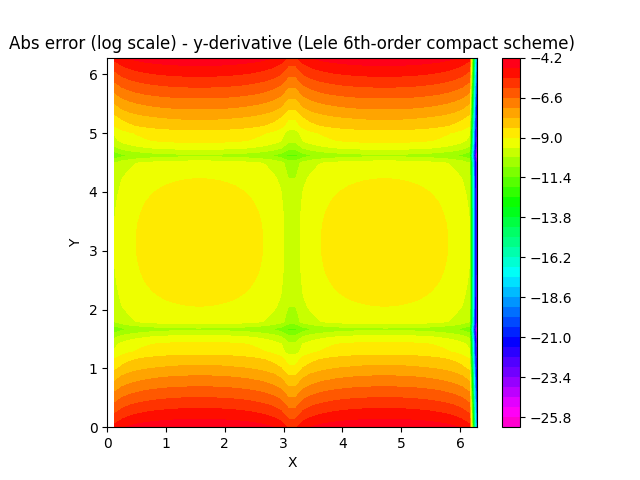
