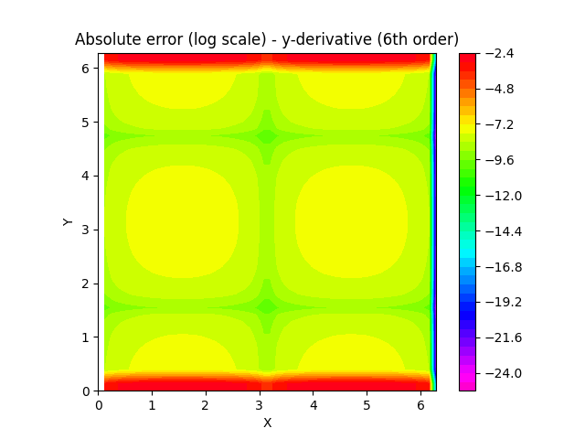

# finite_difference

Computes finite difference matrices for the first and second derivative up to sixth order, including compact finite-difference schemes such as the fourth-order Padé scheme and sixth-order Lele scheme (S. K. Lele. Compact finite difference schemes with spectral-like resolution. Journal of Computational Physics, 103(1):16–42, November 1992.

## Example

The function shown in the example files is given by:

The partial derivatives are given by:

The images below show the absolute error in log scale for both the partial derivatives in x and y direction.

### Second order

 

### Fourth order

 

### Sixth order

 

### Padé fourth order

 

### Lele sixth order

 
